<!-- .slide: data-background-image="img/map.jpg" data-background-size="contain"-->
<!-- .slide: class="hover"-->

### Notes pour une littérature de terrain. Le devenir-spatial de la littérature numérique.

#### Enrico Agostini-Marchese
Cartographie du Web littéraire francophone
 
23 janvier 2020

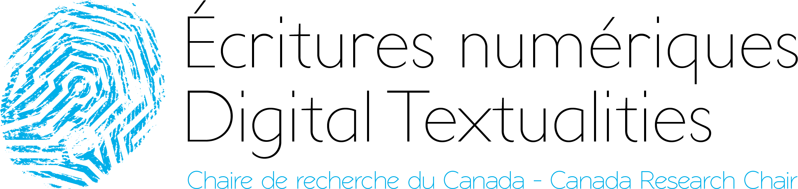 <!-- .element: class="logo" style="width:30%; background-color:ghostwhite;padding: 5px" -->

<!-- .element: style="font-size:1.4rem" -->

 <!-- .element: class="logo" -->

§§§§§§§§§§§§§§§§§§§§§§§§§§§§§§§§§§§§§§§§§§§§§
<!-- .slide: data-background-image="img/chaire.png" data-background-size="contain"-->
%%%%%%%%%%%%%%%%%%%%%%%%%%%%%%%%%%%%%%%%%%%%%
<!-- .slide: data-background-image="img/location.jpg" -->
<!-- .slide: class="hover"-->

### Geolocalisationn

- 2008, iPhone avec GPS
- Médias et réseaux sociaux basés sur la localisation
- Arts et géolocalisation : littérature
§§§§§§§§§§§§§§§§§§§§§§§§§§§§§§§§§§§§§§§§§§§§§
<!-- .slide: data-background-image="img/tendre.jpg" -->
<!-- .slide: class="hover"-->

### La littérature et l'espace

- Homère, Ulysse et Ithaque
- « Aujourd'hui, si nous voulons une représentation de la ville "idéale" et de sa relation avec l'univers. [...] Ce sont les auteurs de science-fiction qui l'apportent. Dans les romans de science-fiction, toutes les variantes possibles et impossibles de la future réalité urbaine ont été envisagées »
- _Neuromancien_ de William Gibson : le cyberespace
- Tournant spatial

Henri Lefebvre, _Le droit à la ville_, Paris, Anthropos, 1967.

<!-- .element: class="source" -->
%%%%%%%%%%%%%%%%%%%%%%%%%%%%%%%%%%%%%%%%%%%%%
<!-- .slide: data-background-image="img/leo-3rd-gen.jpg" -->
<!-- .slide: class="hover"-->
### Trois générations d'e-lit

- Liens hypertextes
- Polyvalence médiatique
- Dispositifs mobiles

%%%%%%%%%%%%%%%%%%%%%%%%%%%%%%%%%%%%%%%%%%%%%
<!-- .slide: data-background-image="img/madeleine.jpg" -->
<!-- .slide: class="hover"-->
### Dispositifs mobiles et littérature. Mobilité et portabilité

- Des écrans reliés (Bertrand Gervais) aux écrans déliés
- Les affordances des plateformes (Twitter, Facebook, etc.) et des appareils (textes courts, photos, emojis, etc.)
- Formes poétiques et littéraires spécifiques
  - Non nativement numérique
  - Nativement numérique
§§§§§§§§§§§§§§§§§§§§§§§§§§§§§§§§§§§§§§§§§§§§§
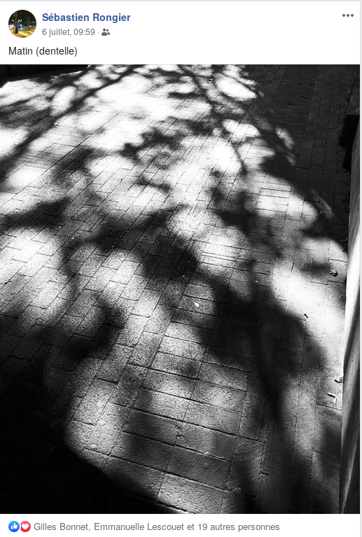
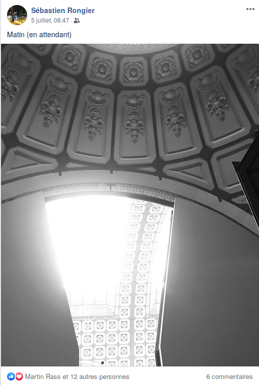
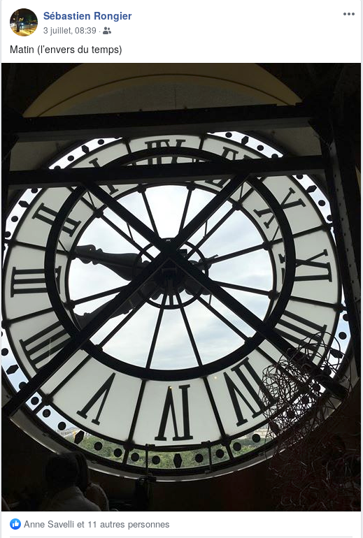
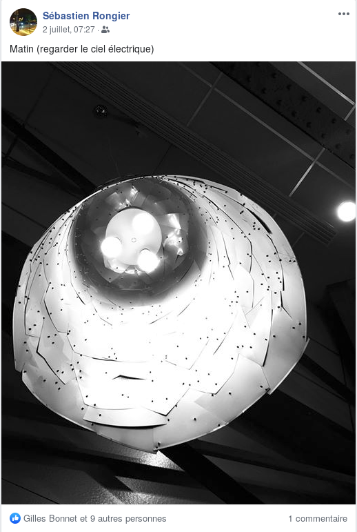
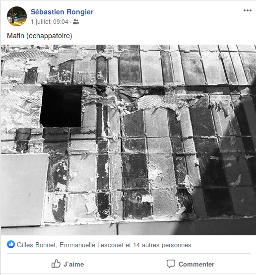
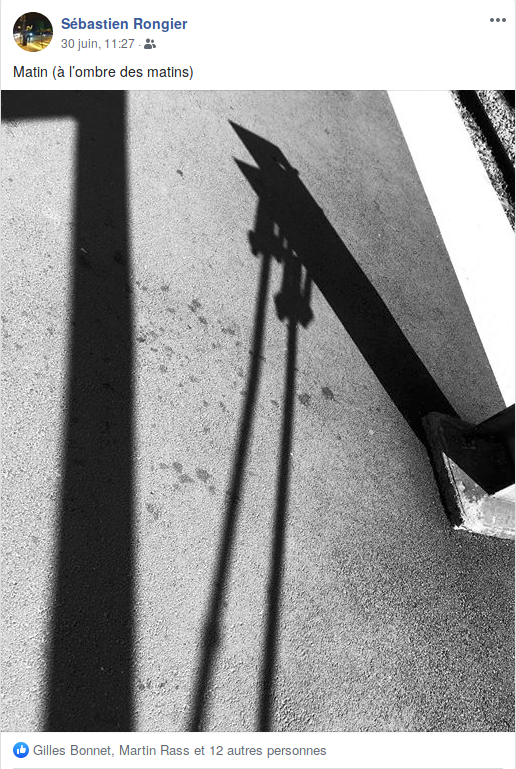
§§§§§§§§§§§§§§§§§§§§§§§§§§§§§§§§§§§§§§§§§§§§§
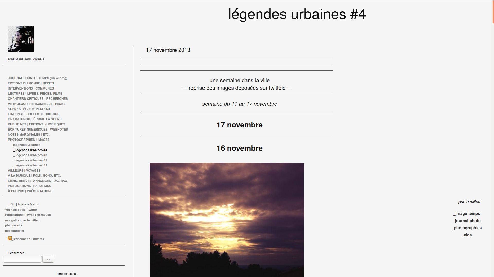
§§§§§§§§§§§§§§§§§§§§§§§§§§§§§§§§§§§§§§§§§§§§§
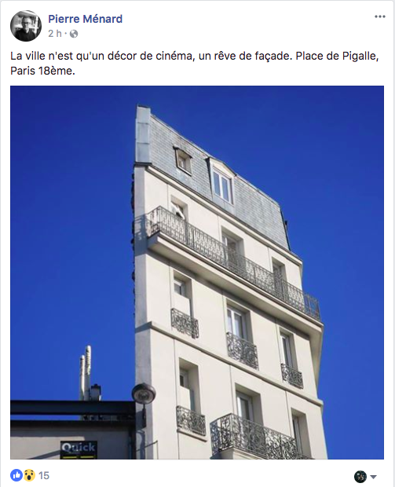
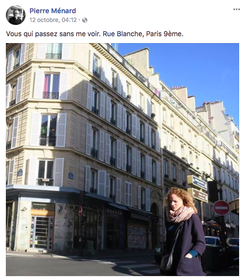
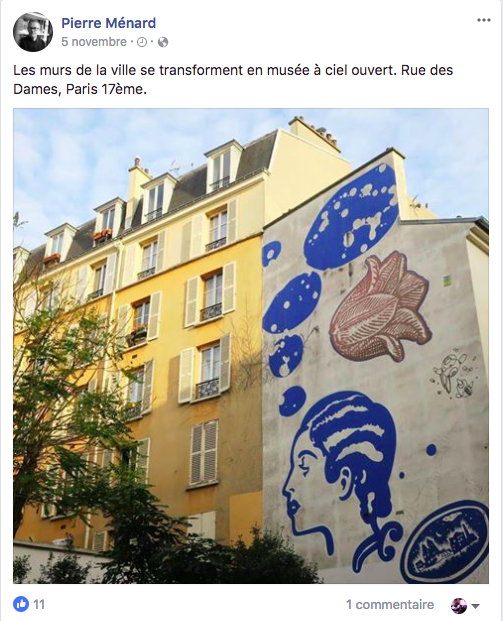
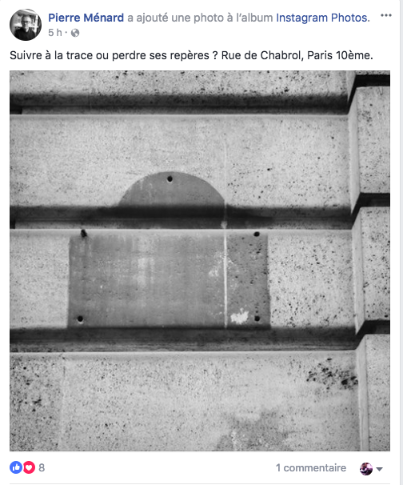
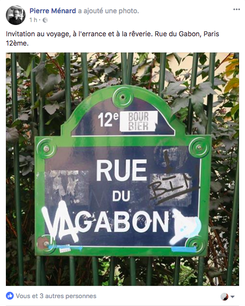
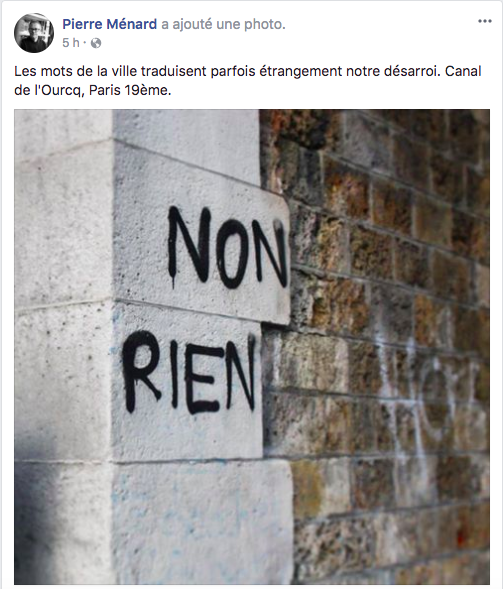
§§§§§§§§§§§§§§§§§§§§§§§§§§§§§§§§§§§§§§§§§§§§§
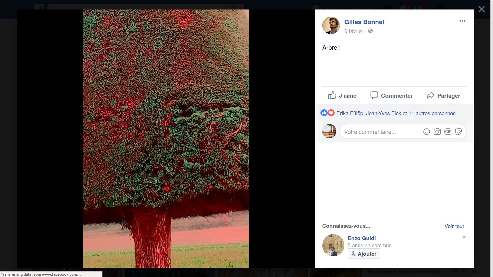
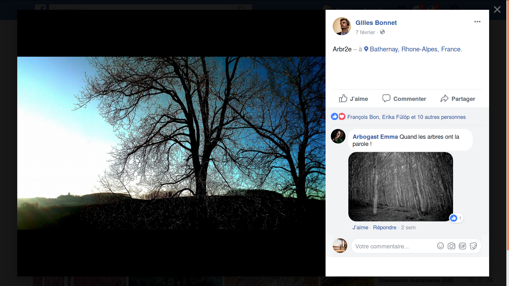
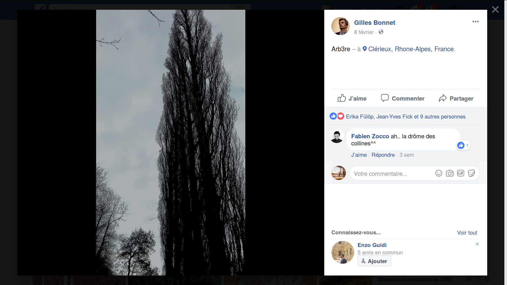
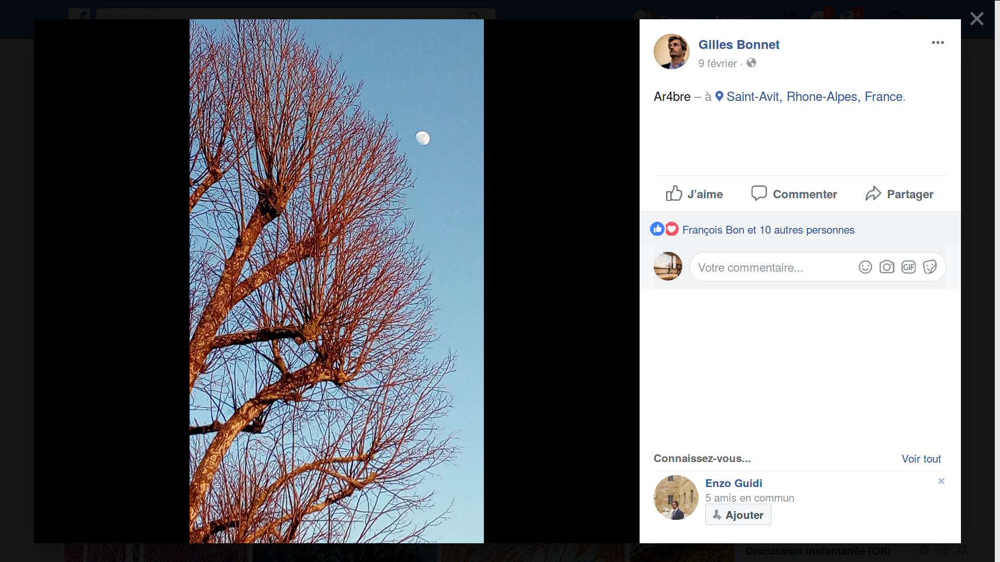
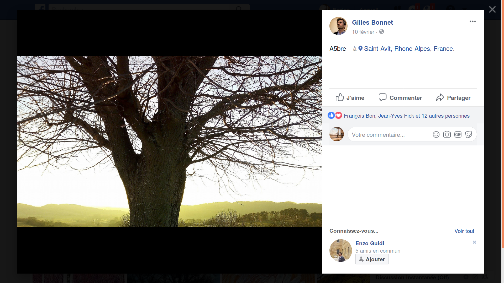
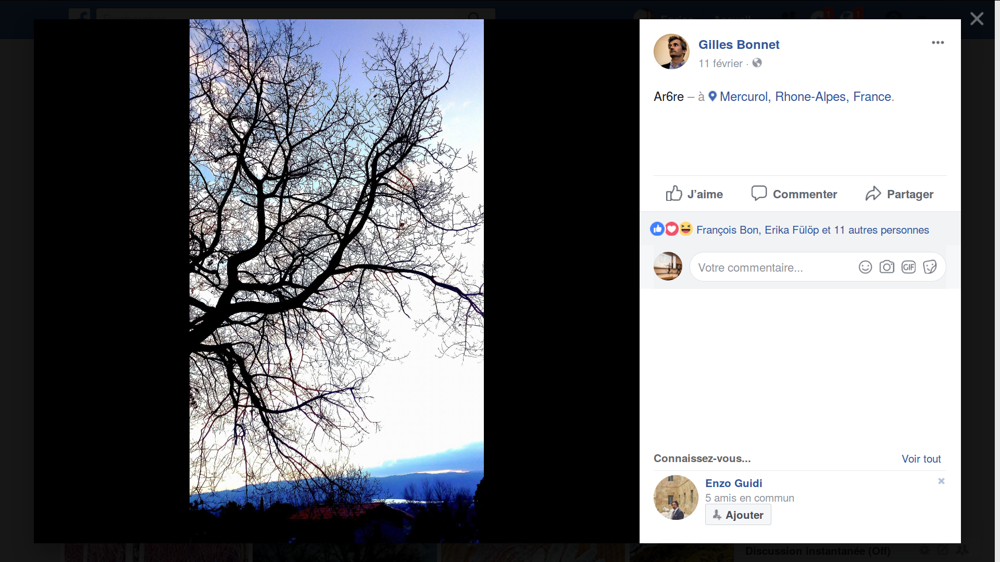
§§§§§§§§§§§§§§§§§§§§§§§§§§§§§§§§§§§§§§§§§§§§§
<!-- .slide: data-background-image="img/disparition.png" -->
§§§§§§§§§§§§§§§§§§§§§§§§§§§§§§§§§§§§§§§§§§§§§
<!-- .slide: data-background-image="img/sp38.png" -->
%%%%%%%%%%%%%%%%%%%%%%%%%%%%%%%%%%%%%%%%%%%%%
<!-- .slide: data-background-image="img/pokemon.jpg" -->
<!-- .slide: class="hover"-->
### Dispositifs mobiles et littérature. Connexion (Internet)

- Toujours connecté : hyper-connecté
- Internet et géolocalisation
  - Notre relation à l'espace a changé
  - Le lieu devient un matériau littéraire

§§§§§§§§§§§§§§§§§§§§§§§§§§§§§§§§§§§§§§§§§§§§§
  
  
  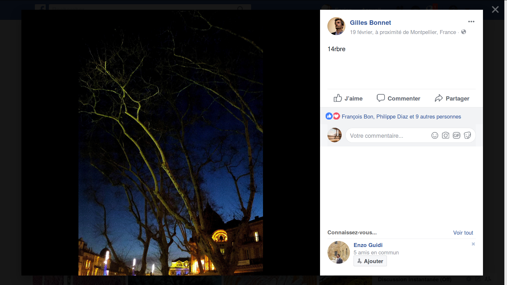
§§§§§§§§§§§§§§§§§§§§§§§§§§§§§§§§§§§§§§§§§§§§§
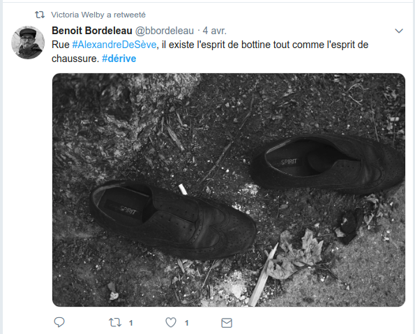
§§§§§§§§§§§§§§§§§§§§§§§§§§§§§§§§§§§§§§§§§§§§§
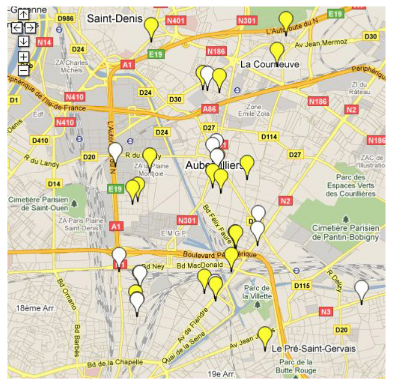
%%%%%%%%%%%%%%%%%%%%%%%%%%%%%%%%%%%%%%%%%%%%%
<!-- .slide: data-background-image="img/map.jpg" data-background-size="contain"-->
<!-- .slide: class="hover"-->
### Dispositifs mobiles et littérature. Interfaces et gestes littéraires

- Écrans tactiles
- Médiations ultérieures
§§§§§§§§§§§§§§§§§§§§§§§§§§§§§§§§§§§§§§§§§§§§§
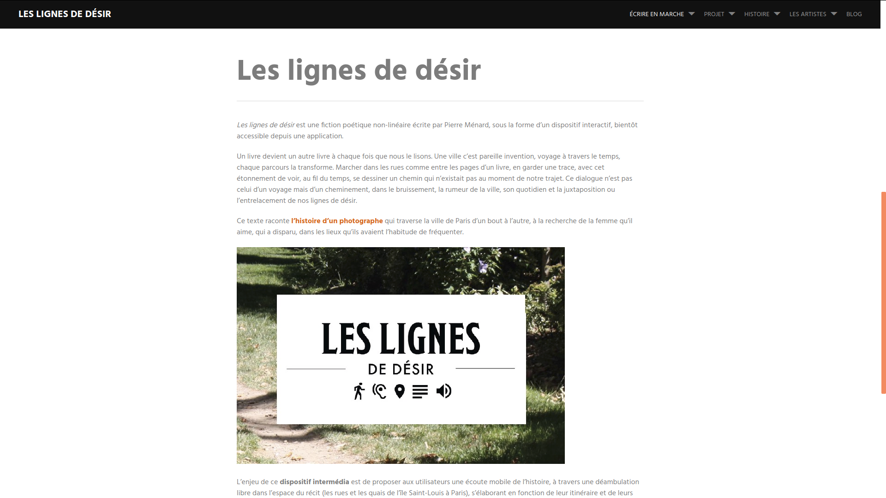
§§§§§§§§§§§§§§§§§§§§§§§§§§§§§§§§§§§§§§§§§§§§§
<!-- .slide: data-background-image="img/oloe.png" data-background-size="contain"-->

source image : Anne Savelli, _Oloé_.

<!-- .element: class="source" -->
